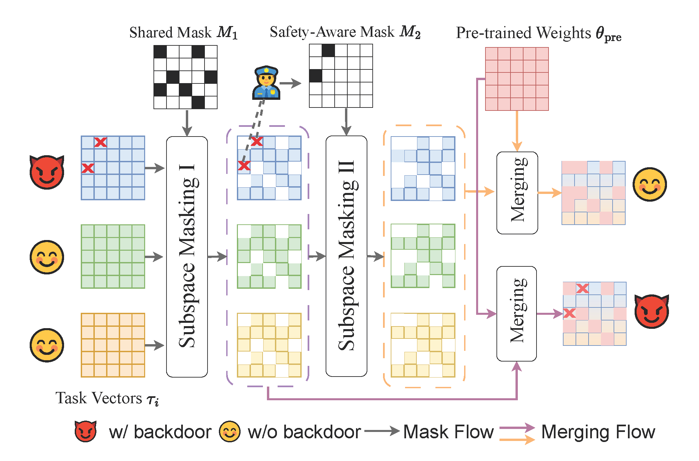

# Mitigating the Backdoor Effect for Multi-Task Model Merging via Safety-Aware Subspace （ICLR2025)

## Introduction
We propose a novel defense-aware merging algorithm to tackle backdoor risks in model merging during CLIP Safety-Fine-tuning, based on orthogonal subspaces guided by safety, co-optimizing performance and safety across downstream tasks

The code base is orgainized based on the https://github.com/tanganke/fusion_bench.




## Installation

Install from PyPI:

```bash
pip install fusion-bench
```

or install the latest version in development from github repository

```bash
git clone https://github.com/tanganke/fusion_bench.git
cd fusion_bench

pip install -e . # install the package in editable mode
```

> [!TIP]
> FusionBench is highly dependent on the use of [Hydra](https://hydra.cc/) for configuration management and command line argument parsing, and [Lightning Fabric](https://lightning.ai/) for device management.
> If you are not familiar with these tools, it is strongly recommended to read the [Hydra](https://hydra.cc/docs/intro/) and [Lightning Fabric](https://lightning.ai/docs/fabric/stable/) documentation.

### Install with [Language Model Evaluation Harness](https://github.com/EleutherAI/lm-evaluation-harness)

[](https://doi.org/10.5281/zenodo.10256836)


```bash
pip install "fusion-bench[lm-eval-harness]"
```

or install from local directory

```bash
pip install -e ".[lm-eval-harness]"
```

This will install the latest version of fusion-bench and the dependencies required for LM-Eval Harness.
Documentation for using LM-Eval Harness within FusionBench framework can be found at [this online documentation](https://tanganke.github.io/fusion_bench/taskpool/lm_eval_harness) or in the [`docs/taskpool/lm_eval_harness.md`](docs/taskpool/lm_eval_harness.md) markdown file.

> [!TIP]
> Documentation for merging large language models using FusionBench can be found at [this online documentation](https://tanganke.github.io/fusion_bench/modelpool/causal_lm) or in the [`docs/modelpool/causal_lm.md`](docs/modelpool/causal_lm.md) markdown file.

## Project Structure

The project is structured as follows:

- `fusion_bench/`: the main package of the benchmark.
  - `method`: contains the implementation of the fusion methods.
    > **naming convention**: `fusion_bench/method/{method_name}/{variant}.py` contains the implementation of the specific method or its variants.
      For example, `fusion_bench/method/regmean/clip_regmean.py` contains the implementation of the RegMean algorithm for CLIP vision models.
  - `modelpool`: contains the implementation of the model pool, responsible for managing the models and dataset to be loaded.
  - `taskpool`: contains the implementation of the task pool, responsible for evaluating the performance of models returned by the algorithm.
- `config/`: configuration files for the benchmark. We use [Hydra](https://hydra.cc/) to manage the configurations.
  - `method`: configuration files for the fusion methods.
    > **naming convention**: `config/method/{method_name}/{variant}.yaml` contains the configuration for the specific method or its variants.
  - `modelpool`: configuration files for the model pool.
  - `taskpool`: configuration files for the task pool.
  - `model`: configuration files for the models.
  - `dataset`: configuration files for the datasets.
- `docs/`: documentation for the benchmark. We use [mkdocs](https://www.mkdocs.org/) to generate the documentation. Start the documentation server locally with `mkdocs serve`. The required packages can be installed with `pip install -r mkdocs-requirements.txt`.
- `examples/`: example scripts for running some of the experiments.
  > **naming convention**: `examples/{method_name}/` contains the files such as bash scripts and jupyter notebooks for the specific method.
- `tests/`: unit tests for the benchmark.## Project Structure


## Citation
```
@article{yang2024mitigating,
  title={Mitigating the Backdoor Effect for Multi-Task Model Merging via Safety-Aware Subspace},
  author={Yang, Jinluan and Tang, Anke and Zhu, Didi and Chen, Zhengyu and Shen, Li and Wu, Fei},
  journal={arXiv preprint arXiv:2410.13910},
  year={2024}
}

```
## Acknowledgements

Some of the code in this repository is based on the following repositories:

- https://github.com/tanganke/fusion_bench
- https://github.com/tanganke/pytorch_classification
- https://github.com/mxzheng/TrojViT
- https://github.com/SCLBD/BackdoorBench